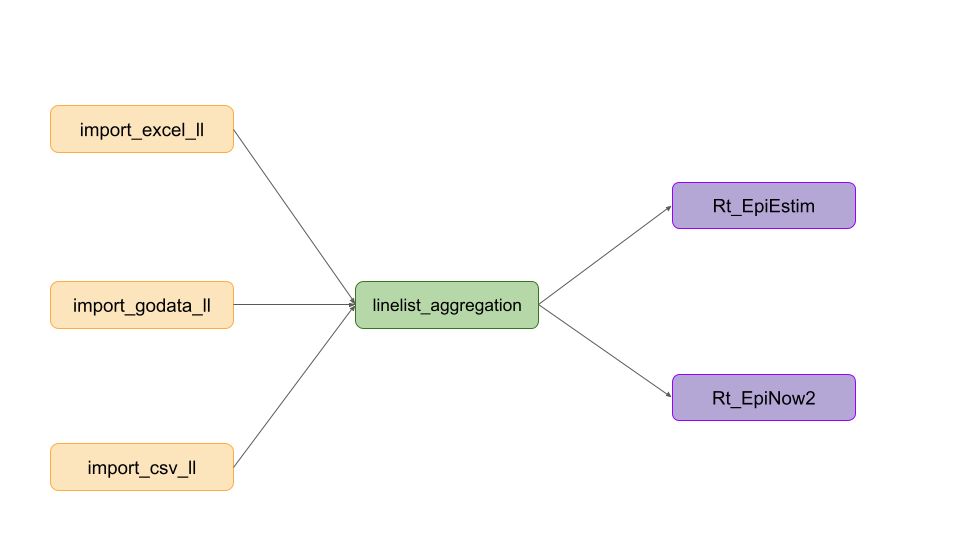

```{r, include = FALSE}
knitr::opts_chunk$set(
  collapse = TRUE,
  comment = "#>"
)
```

_epipipe_ is an R package containing vignettes that explain individual tasks
for epidemiological analysis and building custom pipelines. The vignettes are
designed to be used together by copying and pasting code into an R script to 
ensure that units of epidemiological data wrangling or analysis are interoperable.
_epipipe_ achieves this by providing _"glue"_ code to ensure that packages or 
functions work together seamlessly. 

_epipipe_ currently contains six vignettes. Three explain how to import 
linelist data into R. One explains how to clean and aggregate linelist. Two
explain how to estimate disease transmissibility. The code from each vignette 
can be copy and pasted into an R script to create a bespoke pipeline given the 
data available and the requirements of the analysis.

{width=80%}
